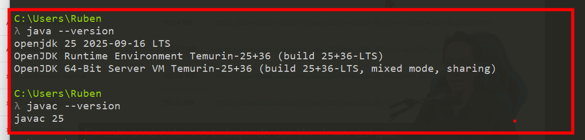

# 🧭 Guía: Instalar el JDK (Java Development Kit)

## 🎯 Objetivo

Instalar y configurar el Java Development Kit (JDK) para poder compilar y ejecutar programas Java en cualquier entorno.

## 🛠️ Requisitos o herramientas necesarias

- [ ] Conexión a Internet  
- [ ] Permisos de administrador en el sistema  
- [ ] Conocimientos básicos de instalación de software

## 📋 Pasos a seguir

1. **Descargar el JDK (OpenJDK recomendado)**  
   - Sitios oficiales:  
     🔗 [Adoptium – Temurin](https://adoptium.net/es/temurin/releases)  
     🔗 [Java oficial (OpenJDK)](https://jdk.java.net/25/)
   - Se recomienda **OpenJDK Temurin**, libre y compatible con la mayoría de entornos Java.

2. **Instalar el JDK**
   - Ejecuta el instalador y sigue las instrucciones.  
   - Acepta las rutas predeterminadas (ej. `C:\Program Files\Eclipse Adoptium\jdk-XX`).  

3. **Configurar la variable de entorno `JAVA_HOME`**
   - Define `JAVA_HOME` apuntando a la carpeta donde se instaló el JDK.  
   - Agrega al `PATH` la ruta:  
     ```
     %JAVA_HOME%\bin
     ```

4. **Verificar la instalación**
   - Abre una terminal o consola y ejecuta:
     ```bash
     java -version
     ```
     Deberías ver la versión instalada del JDK.

## 💡 Idea clave

El JDK es la **caja de herramientas esencial** para desarrollar en Java: incluye el compilador (`javac`), la máquina virtual (JVM) y bibliotecas base del lenguaje.


## 🧠 Tips y recomendaciones

- Usa **OpenJDK (Temurin)** para proyectos educativos o empresariales sin restricciones de licencia.  
- Si instalas múltiples versiones, asegúrate de que `JAVA_HOME` apunte a la correcta.  
- Evita usar solo el **JRE**: no incluye herramientas de desarrollo como `javac`.

## 🤔 Reflexión

El JDK representa el primer paso para entrar en el ecosistema Java: sin él, no es posible compilar ni ejecutar aplicaciones Java.

## ✍️ Resumen

☕ Instala y configura el JDK para habilitar el desarrollo de programas Java.