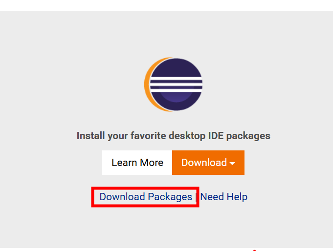
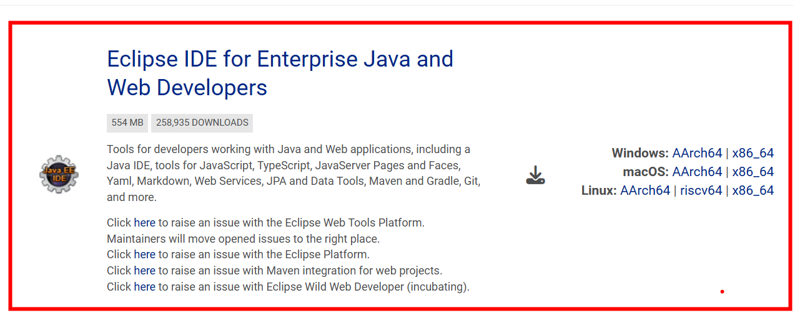

# 🧭 Guía: Descargar y preparar Eclipse IDE para desarrollo en Java

## 🎯 Objetivo

Descargar, preparar y ejecutar **Eclipse IDE** correctamente para desarrollar aplicaciones en **Java**, configurando un entorno de trabajo (*workspace*) adecuado para gestionar proyectos.

## 🛠️ Requisitos o herramientas necesarias

* [ ] Conexión a Internet
* [ ] JDK instalado previamente
* [ ] Permisos para descomprimir archivos
* [ ] Conocimientos básicos del sistema operativo (Windows, Linux o macOS)

## 📋 Pasos a seguir

1. **Acceder al sitio oficial de Eclipse**
   Visita la página oficial de descargas de Eclipse, donde siempre encontrarás la versión más actualizada del IDE:
   🔗 [Eclipse Downloads | The Eclipse Foundation](https://www.eclipse.org/downloads/)

2. **Seleccionar “Download Packages”**
   Dentro del sitio, abre la sección **Download Packages** para ver todas las distribuciones disponibles.
   Cada paquete es como una **navaja suiza**: todos son Eclipse, pero cada uno incluye herramientas distintas según el tipo de desarrollo.

   

3. **Elegir “Eclipse IDE for Enterprise Java and Web Developers”**
   Esta distribución es ideal para Java porque incluye soporte para:

   * Java SE
   * Jakarta EE
   * Servlets y JSP
   * JPA
   * Servidores como **Tomcat, Payara, Jetty y WildFly**

   

4. **Descargar según el sistema operativo**
   Selecciona el archivo correspondiente a tu sistema:

   * Windows
   * Linux
   * macOS

   Normalmente se descarga como archivo **ZIP** o **TAR.GZ**, lo que reduce el tamaño y facilita la transferencia.

5. **Descomprimir y ubicar la carpeta de Eclipse**
   Una vez descargado, descomprime el archivo.
   Aparecerá una carpeta llamada **`eclipse`**, que contiene el programa completo (no requiere instalación).

   Ubícala en un lugar estable, por ejemplo:

   * Windows: `C:\Program Files\Eclipse`
   * Linux: `/opt/eclipse`
   * macOS: una carpeta segura de aplicaciones

   ⚠️ Evita mover la carpeta después para prevenir errores de configuración.

6. **Seleccionar el Workspace al iniciar Eclipse**
   Al ejecutar Eclipse por primera vez, se te pedirá elegir un **workspace**, que es la carpeta donde se guardarán todos tus proyectos.

   * Puedes usar la ruta sugerida o definir una personalizada
   * Puedes marcar la opción para usar siempre ese workspace
   * Si cambias el workspace en el futuro, deberás indicárselo nuevamente a Eclipse

## 💡 Idea clave

Eclipse es una **caja de herramientas modular**: el paquete correcto define qué tan preparado estarás para desarrollar aplicaciones Java estándar, web o empresariales.

## 🧠 Tips y recomendaciones

* Usa siempre la **distribución adecuada al tipo de proyecto** (Java SE vs Enterprise).
* Mantén el **workspace separado** de la carpeta del IDE.
* Verifica que Eclipse esté usando el **JDK correcto**, no solo un JRE.
* Si algo falla al iniciar, revisa primero la ubicación del workspace.

## 🤔 Reflexión

Un IDE bien configurado no solo facilita escribir código: reduce errores, organiza proyectos y acelera el aprendizaje del ecosistema Java.

## ✍️ Resumen

☕ Descarga Eclipse desde su sitio oficial, elige la distribución correcta para Java, descomprímelo en una ubicación estable y configura un workspace para comenzar a desarrollar.
