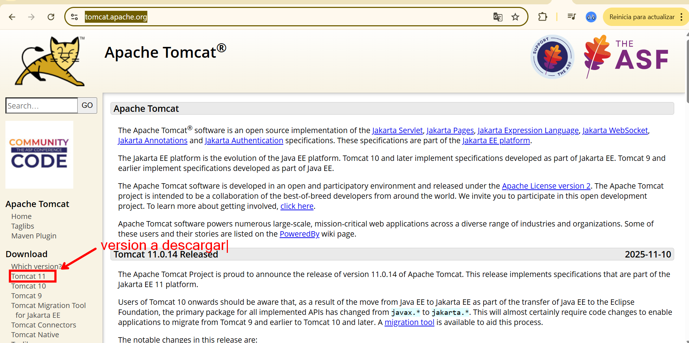
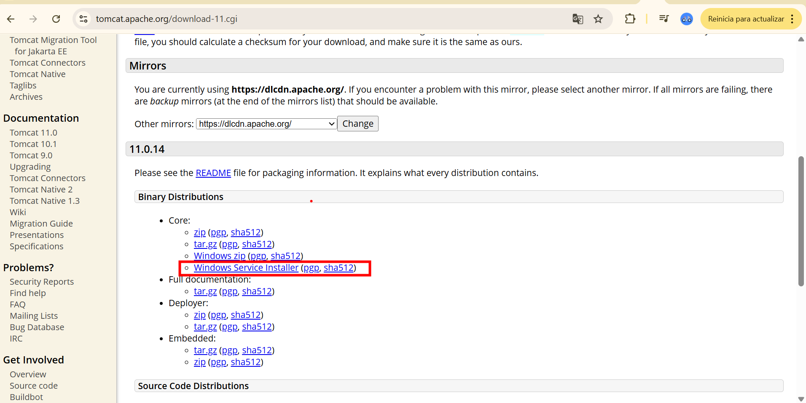
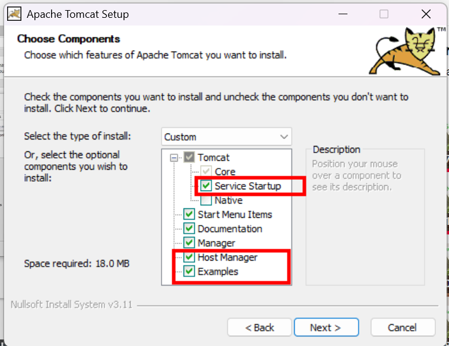
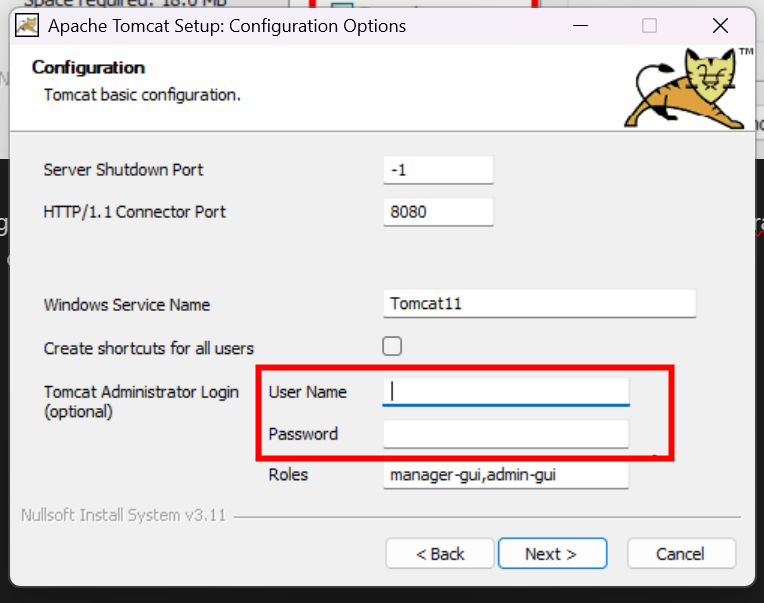
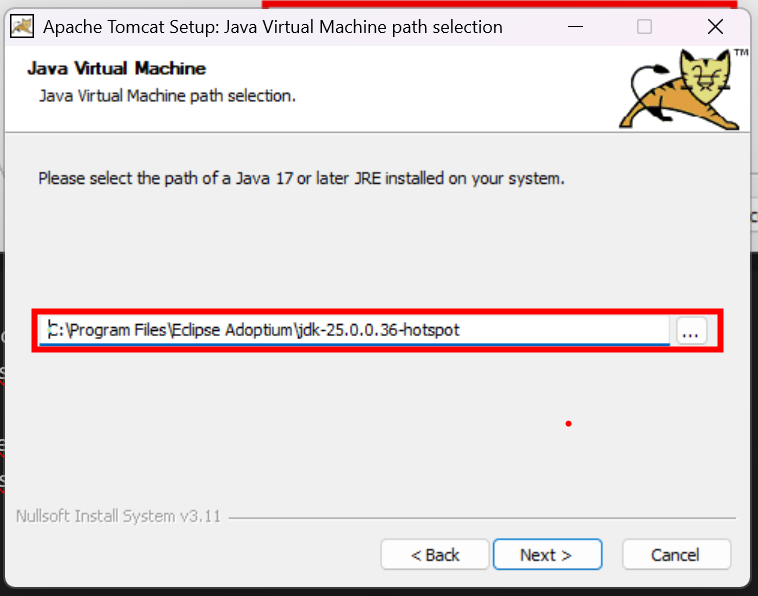

# 🧭 Guía: Instalar Apache Tomcat en Windows

## 🎯 Objetivo

Instalar y configurar **Apache Tomcat** en Windows para poder ejecutar aplicaciones web desarrolladas en **Java**, como **Servlets** y **JSP**.

## 🛠️ Requisitos o herramientas necesarias

* [ ] JDK instalado previamente
* [ ] Conexión a Internet
* [ ] Permisos de administrador en Windows
* [ ] Navegador web
* [ ] Conocimientos básicos de Java web

## 📋 Pasos a seguir

1. **Abrir la página oficial de Apache Tomcat**
   Accede al sitio oficial donde se publican todas las versiones del servidor:
   🔗 [https://tomcat.apache.org/](https://tomcat.apache.org/)

2. **Seleccionar la versión a instalar**
   Elige la versión **11** (o la que necesites según tu proyecto).
   Para Windows, selecciona el **instalador `.exe`**, que facilita la configuración.

   

3. **Descargar el instalador**
   Guarda el archivo en tu equipo.
   De forma opcional, puedes verificar el **hash** para asegurar que la descarga sea legítima y no haya sido alterada.

   

4. **Ejecutar el instalador**
   Abre el archivo descargado y sigue el asistente.
   Durante la instalación, puedes marcar la opción para que Tomcat funcione como **servicio de Windows**, lo que permite que se inicie automáticamente al encender el equipo.

   

5. **Configurar usuario y contraseña**
   Define un usuario administrador y una contraseña para acceder al **panel de administración de Tomcat**.
   Esto garantiza que solo personas autorizadas puedan administrar el servidor.

   

6. **Seleccionar la ruta del JDK o JRE**
   Tomcat necesita Java para ejecutarse.
   Indica la ruta donde tengas instalado el **JDK** (recomendado) o el **JRE**.

   

7. **Elegir la carpeta de instalación**
   Define la ubicación donde se instalará Tomcat en el sistema.
   Se recomienda una ruta estable y fácil de identificar.

8. **Finalizar la instalación**
   Al completar el asistente, Tomcat quedará instalado y funcionando como un **servicio**, listo para ejecutar aplicaciones web Java.

## 💡 Idea clave

Apache Tomcat no sirve páginas web estáticas: su verdadero propósito es **ejecutar código Java del lado del servidor** (Servlets y JSP) y devolver el resultado al navegador.

## 🧠 Tips y recomendaciones

* Usa siempre **JDK**, no solo JRE, para desarrollo.
* Cambia las credenciales por defecto del panel de administración.
* Verifica que Tomcat esté usando la versión correcta de Java.
* Si Tomcat no inicia, revisa primero el servicio de Windows y la ruta del JDK.

## 🤔 Reflexión

El navegador no entiende Java del lado del servidor. Tomcat actúa como un **intérprete**, ejecutando el código Java y entregando al navegador solo el resultado final.

## ✍️ Resumen

🧩 Apache Tomcat es el intermediario que permite que aplicaciones web escritas en Java puedan ejecutarse y comunicarse con los navegadores.
