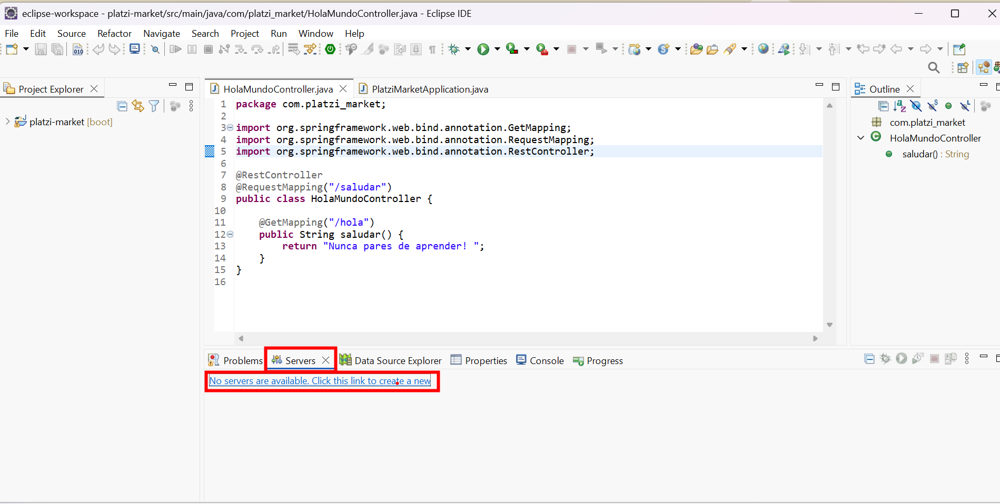
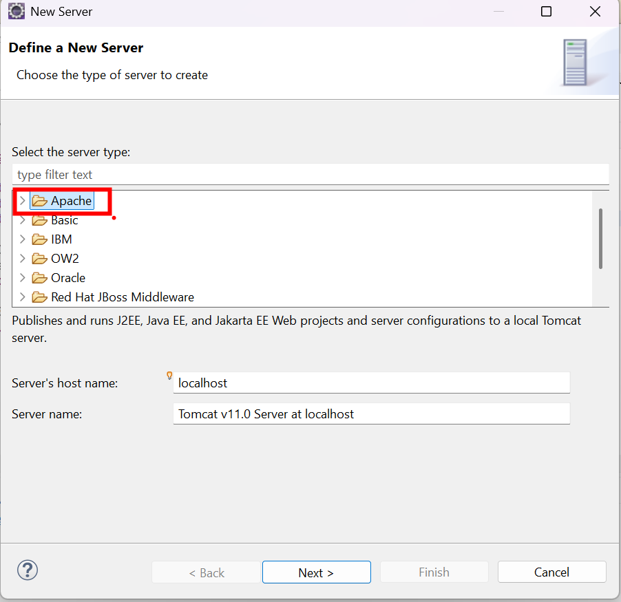
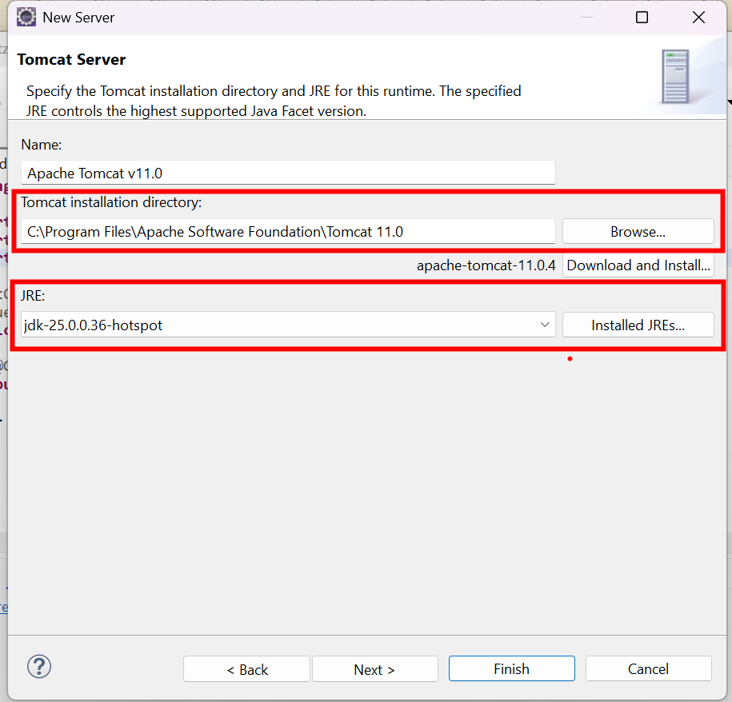
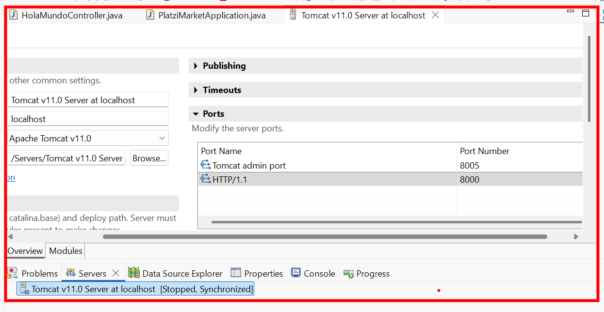

# 🧭 Guía: Configurar Apache Tomcat en Eclipse

## 🎯 Objetivo

Registrar y configurar **Apache Tomcat** dentro de **Eclipse** para poder desarrollar y ejecutar aplicaciones **Java Web** basadas en **Servlets** y **JSP**, resolviendo posibles conflictos de puertos.

## 🛠️ Requisitos o herramientas necesarias

* [ ] Eclipse IDE instalado
* [ ] Apache Tomcat instalado previamente
* [ ] JDK configurado en el sistema
* [ ] Permisos para modificar configuraciones en Eclipse
* [ ] Conocimientos básicos de Java Web

## 📋 Pasos a seguir

1. **Abrir el panel de servidores en Eclipse**
   Inicia Eclipse y dirígete al panel **Servers**, desde donde se administran los servidores de aplicaciones registrados en el IDE.

   

2. **Crear un nuevo servidor**
   Haz clic en **Create a new server**.
   En la ventana de selección:

   * Expande **Apache**
   * Elige la versión correspondiente al Tomcat instalado (por ejemplo, **Tomcat 11**)

   

3. **Indicar la ruta de Tomcat y seleccionar el JDK**
   Presiona **Next** y proporciona:

   * La **ruta de instalación** de Apache Tomcat
   * El **JRE/JDK** que se utilizará para ejecutar el servidor

   🔎 Se recomienda seleccionar el **JDK**, ya que incluye la **JVM** necesaria para ejecutar y depurar aplicaciones web Java.

   

4. **Finalizar la configuración**
   Haz clic en **Finish** para registrar el servidor dentro de Eclipse.

5. **Iniciar el servidor y verificar conflictos de puertos**
   Inicia Tomcat desde el panel **Servers**.

   * Si el servidor arranca correctamente, la configuración fue exitosa.
   * Si aparece un error, probablemente se deba a un **puerto ocupado**.

   Para solucionarlo:

   * Haz doble clic sobre el servidor en el panel *Servers*
   * Modifica los valores de los puertos según sea necesario

   Valores alternativos comunes:

   * **Shutdown port:** `8005`
   * **HTTP/1.1 port:** `8000`

   

## 💡 Idea clave

Tomcat es el **contenedor web** que ejecuta Servlets y JSP, mientras que el **JDK (JVM)** es quien realmente interpreta y ejecuta el código Java dentro del servidor.

## 🧠 Tips y recomendaciones

* Asegúrate de que la **versión de Tomcat en Eclipse** coincida con la instalada.
* Usa siempre **JDK**, no solo JRE.
* Evita usar puertos comunes si tienes otros servidores activos (como 8080).
* Revisa la consola de Eclipse si Tomcat no inicia: allí suelen aparecer pistas claras del error.

## 🤔 Reflexión

Eclipse no ejecuta aplicaciones web por sí solo: necesita un servidor externo como Tomcat para actuar como puente entre el código Java y el navegador.

## ✍️ Resumen

🚀 Configurar Tomcat en Eclipse permite ejecutar y probar aplicaciones Java Web directamente desde el IDE, integrando código, servidor y depuración en un solo entorno.
