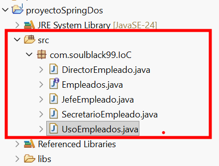

# Ejemplo base de Inversión de Control (IoC) en Java

## 📋 Descripción

Este ejemplo muestra un **escenario base sin Spring**, donde **NO existe Inversión de Control**, y el programador mantiene el control total sobre la creación y uso de los objetos.

Su propósito es servir como **punto de comparación** para entender:

- por qué surge IoC
- qué problema resuelve Spring
- qué cambia cuando el control se delega al framework

---

## 🎯 Objetivo del ejemplo

Demostrar cómo funciona una aplicación cuando:

- el `main` crea directamente los objetos
- las dependencias están ligadas a implementaciones concretas
- el control permanece en el código de la aplicación

Este modelo es el **punto de partida conceptual** antes de aplicar IoC real con Spring.

---

## 🧱 Estructura del proyecto

Se crea un paquete que contiene toda la estructura base:

```

com.soulblack99.IoC  
│  
├── UsoEmpleados.java → Punto de entrada (main)  
├── Empleados.java → Interfaz  
├── DirectorEmpleado.java → Implementación  
├── JefeEmpleado.java → Implementación  
└── SecretarioEmpleado.java → Implementación

````



---

## 🧩 Interfaz `Empleados`

La interfaz define **el contrato**, no la implementación.

```java
package com.soulblack99.IoC;

public interface Empleados {
    public String getTareas();
}
````

📌 Aquí aparece una **buena práctica clave**:

> El código depende de una **abstracción**, no de una clase concreta.

---

## 🧩 Implementación concreta (`SecretarioEmpleado`)

Una de las clases que implementa la interfaz:

```java
package com.soulblack99.IoC;

public class SecretarioEmpleado implements Empleados {

    @Override
    public String getTareas() {
        return "Gestionar la agenda de los jefes";
    }
}
```

Cada implementación define su propio comportamiento, pero **todas cumplen el mismo contrato**.

---

## 🧩 Clase principal (`UsoEmpleados`)

Aquí se observa el **control tradicional**.

```java
package com.soulblack99.IoC;

public class UsoEmpleados {

    public static void main(String[] args) {

        // Creación directa del objeto (control tradicional)
        Empleados empleado1 = new DirectorEmpleado();

        // Uso del objeto creado
        System.out.print(empleado1.getTareas());
    }
}
```

---

## ⚠️ Análisis: ¿dónde NO hay IoC?

Aunque se usa una **interfaz**, el control sigue estando en el `main`:

- el programador decide **qué clase concreta crear**
- el código conoce la implementación (`DirectorEmpleado`)
- cambiar el comportamiento requiere modificar el código

📌 Esto implica:

- **alto acoplamiento**
- poca flexibilidad
- difícil escalabilidad

---

## 💡 Idea central

> Mientras el código cree directamente sus dependencias,  
> **no existe Inversión de Control**, aunque se usen interfaces.

La verdadera IoC aparece cuando:

- el código deja de usar `new`
- otra entidad decide qué implementación usar
- el programador solo declara lo que necesita

---

## 🔗 Conexión directa con Spring

Spring toma este mismo escenario y cambia **solo una cosa clave**:

> El `main` deja de crear objetos  
> y el **contenedor IoC** lo hace por él.

Esto se logra mediante:

- [[inyección de dependencias]]
- configuración de beans
- anotaciones o Java Config

---

## 🧠 20% Pareto (lo imprescindible)

- Usar interfaces **NO es IoC**
- Crear objetos con `new` mantiene el control en el código
- Este ejemplo es el **antes** de Spring
- Spring elimina el `new` del código de negocio
- Aquí nace la necesidad real de IoC

---

## ✍️ Resumen

🌱 Este ejemplo muestra un modelo de control tradicional donde el programador crea y coordina los objetos manualmente.  
Aunque se utilizan interfaces, el control sigue en el código, lo que genera acoplamiento.  
Este escenario sirve como base conceptual para entender por qué Spring introduce la Inversión de Control y cómo cambia radicalmente la estructura de la aplicación.