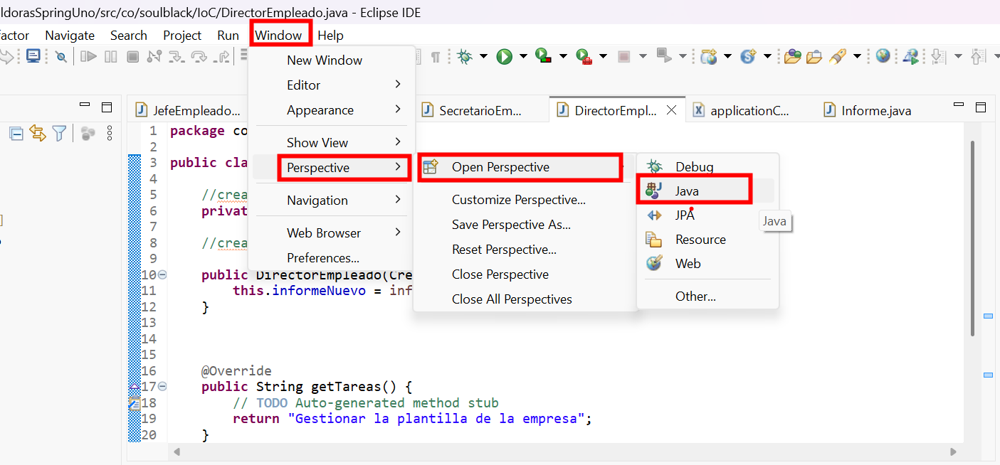
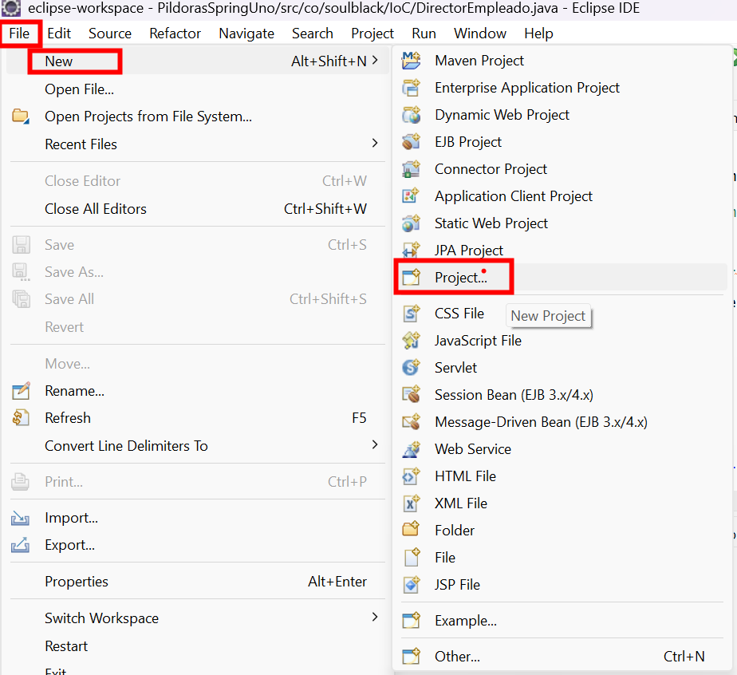
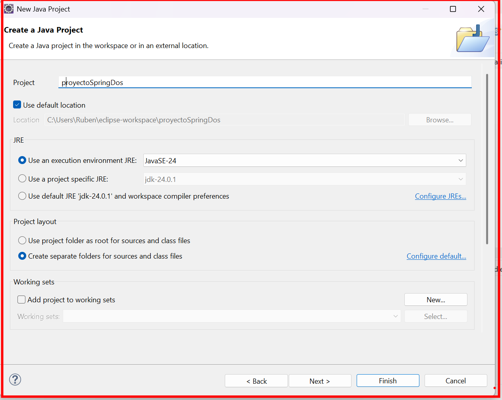
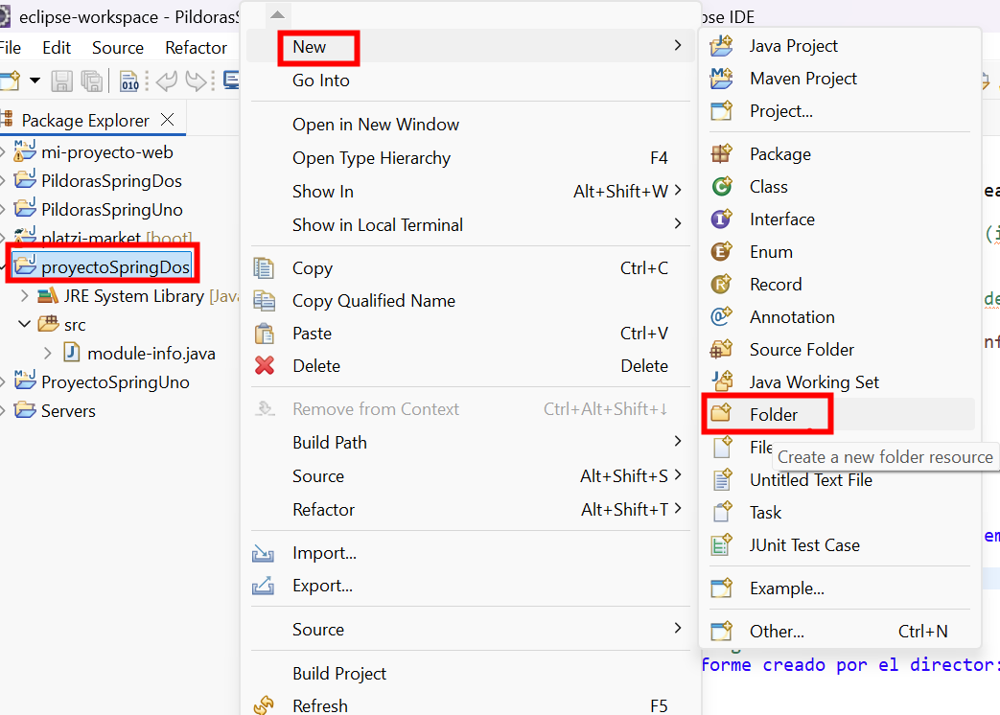
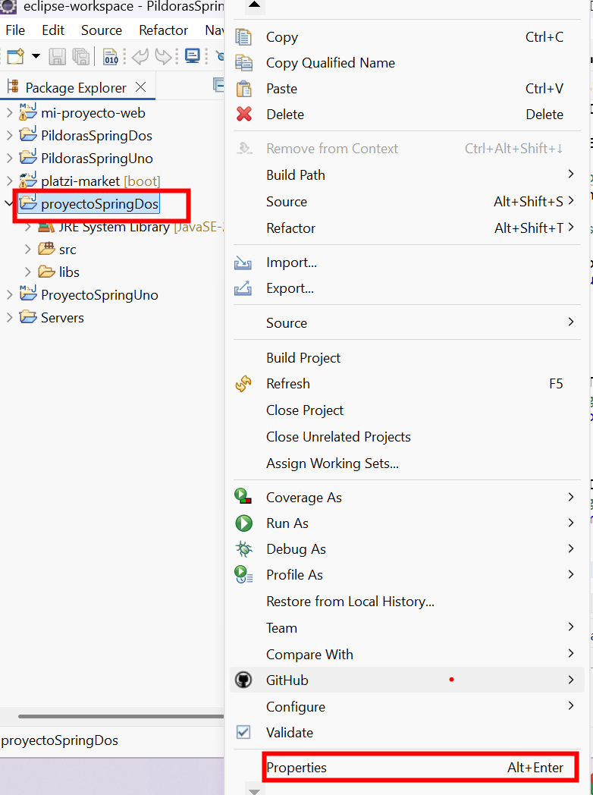
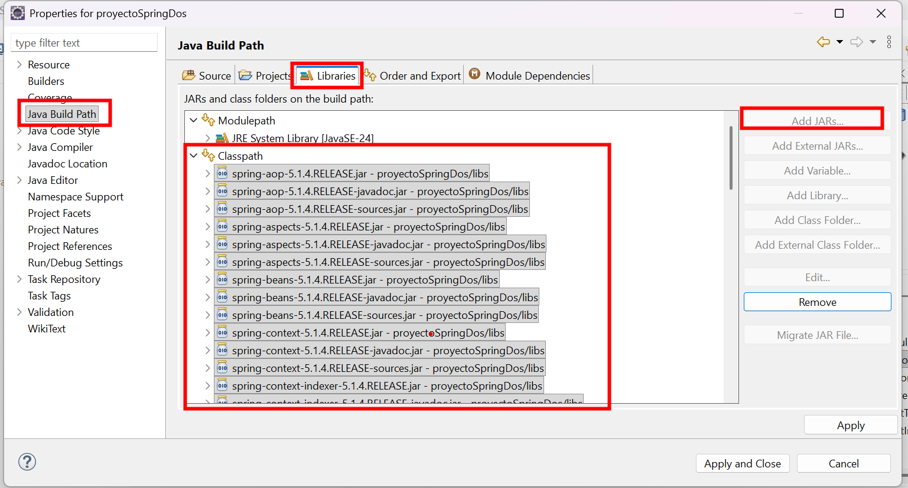

Esta guía explica cómo agregar librerías externas (JAR) manualmente a un proyecto Java en Eclipse y cómo funciona la diferencia entre **ClassPath** y **ModulePath**. Todo se basa en la perspectiva Java y la administración del Build Path.

---

# 🟦 1. Cambiar a la perspectiva Java

Para trabajar correctamente con proyectos Java, cambia la vista de Eclipse:

**Window → Perspective → Open Perspective → Java**

La perspectiva Java organiza las herramientas y paneles para facilitar el desarrollo.

---

# 🟩 2. Crear un proyecto Java

Puedes crear un proyecto Java desde:

**File → New → Java Project**

---

# 🟨 3. Crear la carpeta `libs` para tus librerías externas

En el panel del proyecto, crea una carpeta llamada **libs**.
Aquí guardarás todos los archivos **.jar** que quieras agregar.

---

# 🟧 4. Agregar las librerías al Build Path

Después de copiar los JAR dentro de `libs`, debes indicarle a Eclipse que los use.

Haz clic derecho sobre el proyecto → **Properties**.

Luego entra a:

**Java Build Path → Libraries → ModulePath → Add JARs**

Eclipse creará la sección:

**Referenced Libraries**

que contiene enlaces a los JAR agregados.

---

# 🟥 5. Diferencia entre *ClassPath* y *ModulePath* (explicación integrada)

Desde Java 9 existen dos sistemas para cargar librerías: **ClassPath** y **ModulePath**.

## ✔️ ClassPath (modo tradicional)

- Es el mecanismo clásico.
- Carga librerías sin modularidad.
- Funciona con **cualquier JAR**.
- Ideal para **proyectos Spring** y Java 8/11/17 sin módulos.
- No requiere `module-info.java`.

**Analogía:**  
Una caja gigante donde mezclas todas las piezas y Java busca lo que necesita.

## ✔️ ModulePath (modo modular)

- Introducido en Java 9 con JPMS.
- Organiza librerías como módulos independientes.
- Requiere `module-info.java`.
- Permite mayor control y encapsulamiento.

**Analogía:**  
Muchas cajitas ordenadas donde cada módulo dice qué ofrece y qué usa.