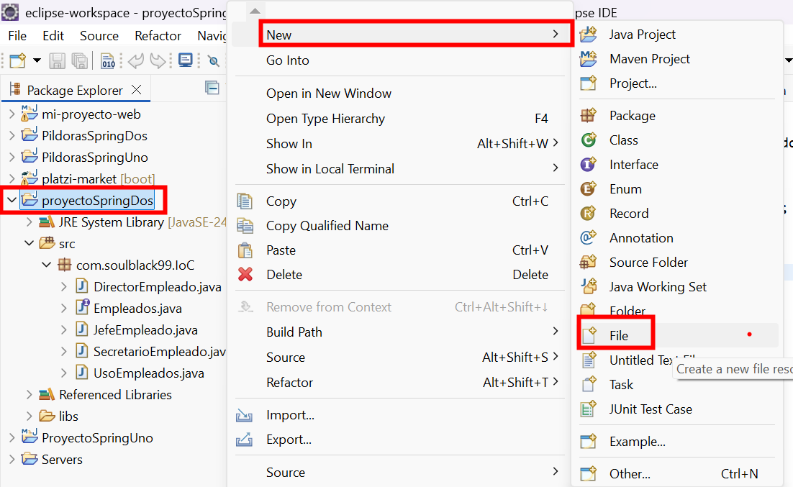
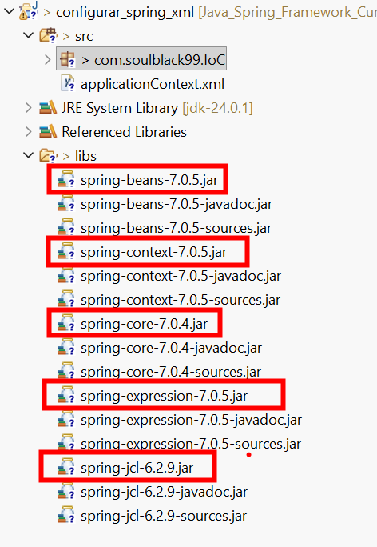

# Configuración de Spring con XML (IoC básico)

## 📋 Descripción

Esta guía explica cómo configurar Spring mediante XML, cómo registrar *beans* en el contenedor y cómo solicitarlos desde Java.

También aclara la diferencia práctica entre:

* Crear objetos de forma tradicional (`new`)
* Usar **Inversión de Control (IoC)** con el framework **Spring Framework**

Es una guía base ideal para entender IoC **sin anotaciones**.

---

## 🟦 1. Crear el archivo `applicationContext.xml`

Para configurar el contenedor usando XML, se crea un archivo llamado:

```
applicationContext.xml
```

📌 Si usas Maven o Gradle, debe ubicarse en:

```
src/main/resources
```

Así estará disponible en el *classpath*.



Dentro se agrega la plantilla base del contenedor:

```xml
<?xml version="1.0" encoding="UTF-8"?>

<beans xmlns="http://www.springframework.org/schema/beans"
       xmlns:xsi="http://www.w3.org/2001/XMLSchema-instance"
       xmlns:context="http://www.springframework.org/schema/context"
       xsi:schemaLocation="
       http://www.springframework.org/schema/beans
       https://www.springframework.org/schema/beans/spring-beans.xsd
       http://www.springframework.org/schema/context
       https://www.springframework.org/schema/context/spring-context.xsd">

</beans>
```

Este archivo será el **manual de instrucciones** para Spring.

---

## 🟩 2. Registrar un bean en el contenedor

Para que Spring pueda crear un objeto, debe registrarse como **bean**.

Cada bean define:

* `id` → nombre lógico del objeto
* `class` → clase concreta que Spring debe instanciar
* `scope` → ciclo de vida (opcional)

Ejemplo:

```xml
<bean id="miEmpleado"
      class="com.soulblack99.IoC.DirectorEmpleado"
      scope="singleton"/>
```

📌 Aquí Spring aprende:

> “Cuando alguien pida `miEmpleado`, crea un `DirectorEmpleado`”.

---

### 🔎 Sobre el `scope`

Por defecto es `singleton`:

* Se crea una sola instancia
* Se reutiliza durante toda la aplicación

También puede definirse:

```xml
scope="prototype"
```

* Se crea una nueva instancia cada vez que se solicita el bean

---

### XML completo

```xml
<?xml version="1.0" encoding="UTF-8"?>

<beans xmlns="http://www.springframework.org/schema/beans"
xmlns:xsi="http://www.w3.org/2001/XMLSchema-instance"
xmlns:context="http://www.springframework.org/schema/context"
xsi:schemaLocation="
http://www.springframework.org/schema/beans
https://www.springframework.org/schema/beans/spring-beans.xsd
http://www.springframework.org/schema/context
https://www.springframework.org/schema/context/spring-context.xsd">

    <bean id="miEmpleado"
          class="com.soulblack99.IoC.DirectorEmpleado"
          scope="singleton"/>

</beans>
```

---

## 🟨 3. Usar el contenedor desde Java

### 1️⃣ Cargar el contenedor IoC

```java
ClassPathXmlApplicationContext contexto =
        new ClassPathXmlApplicationContext("applicationContext.xml");
```

Aquí Spring:

* Lee el XML
* Crea los beans
* Los deja listos

---

### 2️⃣ Solicitar un bean

```java
Empleados juan = contexto.getBean("miEmpleado", Empleados.class);
```

📌 El código no crea el objeto, solo lo solicita.

---

### 3️⃣ Usar el objeto

```java
System.out.println(juan.getTareas());
```

---

### 4️⃣ Cerrar el contexto

```java
contexto.close();
```

Esto:

* Libera recursos
* Ejecuta el ciclo de destrucción de los beans

---

### Clase `main` completa

```java
package com.soulblack99.IoC;

import org.springframework.context.support.ClassPathXmlApplicationContext;

public class UsoEmpleados {

    public static void main(String[] args) {

        ClassPathXmlApplicationContext contexto =
                new ClassPathXmlApplicationContext("applicationContext.xml");

        Empleados juan = contexto.getBean("miEmpleado", Empleados.class);

        System.out.println(juan.getTareas());

        contexto.close();
    }
}
```

---

## 🟥 4. IoC vs creación tradicional de objetos

### ✔️ Programación tradicional

```java
Empleados e = new DirectorEmpleado();
```

Tú decides:

* Qué clase usar
* Cuándo crearla
* Cuántas instancias existen
* Cómo configurarla

👉 El control está en tu código.

---

### ✔️ IoC con Spring

```java
Empleados e = contexto.getBean("miEmpleado", Empleados.class);
```

Spring decide:

* Qué clase concreta crear
* Cuándo hacerlo
* Si es singleton o prototype
* Cómo inyectar dependencias
* Cuándo destruirla

👉 El control está en el framework.

---

## ✔️ 5. ¿Pierdo métodos del hijo al usar interfaces?

No.

Si necesitas métodos específicos:

```java
DirectorEmpleado d =
       contexto.getBean("miEmpleado", DirectorEmpleado.class);

d.aprobarPresupuesto();
```

IoC no prohíbe usar clases concretas.
Solo recomienda programar contra interfaces para mantener bajo acoplamiento.

---

## 🧠 6. IoC vs DI

* IoC → principio general
* DI (Dependency Injection) → forma concreta de implementar IoC

Spring implementa IoC principalmente mediante inyección de dependencias.

---

## 📊 7. ¿Dónde está la inversión?

| Antes                   | Ahora                          |
| ----------------------- | ------------------------------ |
| El código crea objetos  | Spring crea objetos            |
| Tú controlas el flujo   | El framework controla el flujo |
| `new` está en tu código | `new` está en el contenedor    |

👉 Eso es la Inversión de Control.

---

## 🧠 20% Pareto

* IoC elimina el `new` del código de negocio
* Spring crea y gestiona objetos
* XML solo da instrucciones
* El contenedor decide cómo y cuándo
* El código solo solicita lo que necesita

---

## 📦 Librerías necesarias

Si trabajas con JAR manuales necesitas:

* spring-beans
* spring-context
* spring-core
* spring-expression
* spring-jcl



📌 Si usas Maven, basta con agregar `spring-context` y las demás dependencias se descargan automáticamente.

---

## ✍️ Resumen final

Configurar Spring con XML permite entender claramente cómo funciona la Inversión de Control.

Al registrar beans en el contenedor y solicitarlos desde Java:

* La creación de objetos deja de estar en el código
* El framework gestiona el ciclo de vida
* Se reduce el acoplamiento
* La aplicación queda preparada para crecer

---

Si quieres, ahora puedo ayudarte a hacer la versión equivalente con anotaciones para que tengas ambas formas documentadas.
